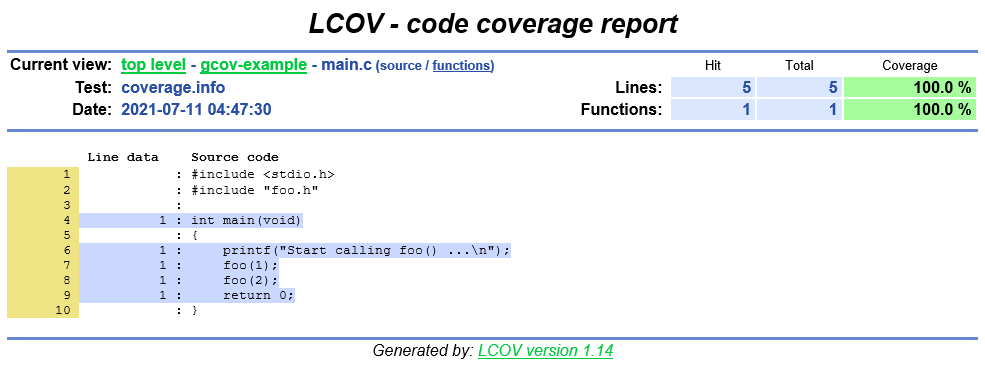
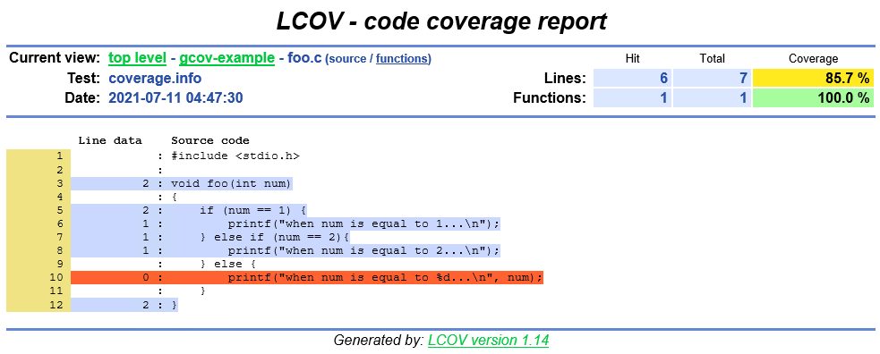

# 使用 Gcov 和 LCOV 对 C/C++ 项目做代码覆盖率测试

## 问题

如果你的 C/C++ 项目没有单元测试代码，而你还想做代码覆盖率测试怎么办？

市面上有一些这些针对 C/C++ 项目代码覆盖率测试的工具，但绝大多数都是收费的。

我在很久之前调研过的 [Squish Coco](https://shenxianpeng.github.io/2019/05/squishcoco/)，由于当时有一些编译问题没有解决，就暂且搁置没有购买。

最近我又开始了关于 C/C++ 项目的代码覆盖率测试的工作，了解到 GCC 实际上提供了代码覆盖率的编译选项 `-fprofile-arcs` 和 `-ftest-coverage`，为了弄清楚 [Gcov](https://gcc.gnu.org/onlinedocs/gcc/Gcov.html) 是如何工作的，做了一些调查，并把这个调查过程做了如下整理。

## 前提

如果想运行这个示例仓库的程序，需要提前安装 [gcc](https://gcc.gnu.org/install/index.html), [lcov](http://ltp.sourceforge.net/coverage/lcov.php)。

## 如何使用该仓库

下载好该仓库代码后，这里包含了所有的编译过程中的文件和报告文件。

执行 `make clean` 命令，可删除所有生成的文件，只保留一些源文件。

```bash
bash-4.2$ ls
foo.c  foo.h  main.c  makefile  README-CN.md  README.md
```

生成代码覆盖率需要执行只需要 3 步：

```bash
# step 1
make

# step 2
./main

# step 3
make report
```

具体每一步请参看下方：

### 1. 编译

```bash
bash-4.2$ make
# this is output
gcc -fPIC -fprofile-arcs -ftest-coverage -c -Wall -Werror -fpic main.c
gcc -fPIC -fprofile-arcs -ftest-coverage -c -Wall -Werror -fpic foo.c
gcc -fPIC -fprofile-arcs -ftest-coverage -o main main.o foo.o
```

再看一下仓库下有多了哪些文件

```bash
bash-4.2$ ls
foo.c  foo.gcno  foo.h  foo.o  main  main.c  main.gcno  main.o  makefile  README-CN.md  README.md
```

在编译完成后，除了 `main`, `.o` 之外还多了两个 `.gcno` 文件。

注：`.gcno` 注释文件是在用 GCC `-ftest-coverage` 选项编译源文件时产生的，它包含了重建基本块图和给块分配源行号的信息。

### 2. 运行可执行文件

当你的程序引入了 `-fprofile-arcs` 和 `-ftest-coverage` 这两个选项并成功编译通过的时候，下一步就是进行测试了。

运行生产的执行文件 `main`

```bash
bash-4.2$ ./main
Start calling foo() ...
when num is equal to 1...
when num is equal to 2...

bash-4.2$ ls
foo.c  foo.gcda  foo.gcno  foo.h  foo.o  main  main.c  main.gcda  main.gcno  main.o  makefile  README-CN.md  README.md
```

看到 `main` 已经成功执行，并又生了两个 `.gcda` 文件，这是一个计数数据文件。

有了 `.gcno` 和 `.gcda` 这两个文件下一步就可以生产了 `.gcov` 这个代码覆盖率的结果文件了

### 3. 生成 `.gcov` 文件

执行需要执行 `gcov main.c foo.c` 就可以生成 `.gcov` 文件了。或者通过 `make gcov` 来生成（这是在 makefile 里已经写好的）。

```bash
gcov main.c foo.c
File 'main.c'
Lines executed:100.00% of 5
Creating 'main.c.gcov'

File 'foo.c'
Lines executed:85.71% of 7
Creating 'foo.c.gcov'

Lines executed:91.67% of 12
```

### 4. 生成报告

上面的输出虽然已经可以知道了 main.c 和 foo.c 这两个源文件的代码覆盖率，但是不够直观，也不能看到具体是哪一行没有执行到。

这里就用到了 LCOV。它是 GCC 的覆盖率测试工具 gcov 的一个图形化前端。它收集了多个源文件的 gcov 数据来创建含有覆盖率信息注释的源代码的 HTML 页面。该 HTML 里提供了概览页面，支持语句、函数和分支覆盖率的信息。

可以通过 `lcov --capture --directory . --output-file coverage.info` 来生成 coverage.info，然后执行 `genhtml coverage.info --output-directory out`

来生成最终的报告。

或是直接执行 `make report` 来生成报告，具体请看 `makefile`。

### 5. 查看报告







## 参考文档

1. Gcov 数据文件重定向：
    * https://gcc.gnu.org/onlinedocs/gcc/Cross-profiling.html#Cross-profiling
    * https://stackoverflow.com/questions/7671612/crossprofiling-with-gcov-but-gcov-prefix-and-gcov-prefix-strip-is-ignored
2. Linux kernel 使用 gcov：https://01.org/linuxgraphics/gfx-docs/drm/dev-tools/gcov.html
3. Squish Coco 与 Gcov/LCOV 的对比，froglogic 官方有一个说明：https://www.froglogic.com/coco/faq/

